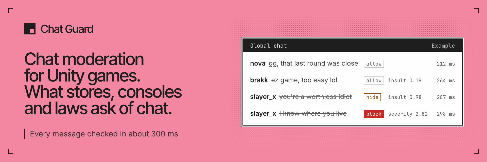

<p><a href="https://chatguard.dev">
<picture>
  <source media="(prefers-color-scheme: dark)" srcset="./banner-dark.png">
  <source media="(prefers-color-scheme: light)" srcset="./banner-light.png">
  
</picture>
</a></p>

Chat Guard checks every chat message in your game before other players see it, in about 300 ms,
and tells trash talk from real abuse. Your game gets back one clear answer (allow, flag, hide or
block) and the scores behind it.

[Website](https://chatguard.dev) · [Docs](https://github.com/chatguard-dev/chat-guard-unity#readme) · [Pricing](https://chatguard.dev/#pricing) · [Discord](https://chatguard.dev/discord) · [Status](https://github.com/chatguard-dev/status)

## What it does

- **The rules, handled.** Stores, consoles and laws expect games with chat to moderate it, and Chat
  Guard takes that work off your studio. Every decision is logged with its scores for 90 days, or
  longer while you keep its message text. Message text isn't stored by default, only a hash of it.
- **Fast and precise.** A fresh check takes about 300 ms; repeats and your own block rules answer in
  a few milliseconds. Each message is judged with the lines before it, its channel and its age rating,
  so banter about the match and an attack on a player get different answers.
- **Tune without shipping a build.** Thresholds and rules live in the dashboard, not in your game.
  Save a change and the next message uses it.
- **Works with your setup.** The Unity package fits Netcode for GameObjects, Mirror, FishNet and
  Photon Fusion. Nakama, Colyseus and any other server send one HTTP request per message. No game
  server (Photon PUN, Photon Chat)? Run the small example relay from the package, or call from the
  game with a publishable key.

## Get started in Unity

1. In Package Manager, choose **Add package from git URL** and paste:

   ```
   https://github.com/chatguard-dev/chat-guard-unity.git
   ```

2. [Sign in](https://app.chatguard.dev/sign-in) with Google or GitHub (no card needed) and create a key.
3. Check each message before you show it:

```csharp
using ChatGuard.Core;
using ChatGuard.Unity;

// Settings come from Assets/Resources/ChatGuardConfig.asset,
// or from code: ChatGuardSdk.Configure(apiKey);
void OnPlayerMessage(string playerId, string text)
{
    ChatGuardSdk.Moderate(text, playerId, result =>
    {
        if (result.ShouldDeliver)   // allow or flag
            ShowInChat(playerId, text);
        else if (result.Action == ModerationAction.Hide)
            ShowToSenderOnly(playerId, text);   // others never see it
        else                        // block
            TellSender(playerId, "Message not delivered");
    });
}
```

The [quick start](https://github.com/chatguard-dev/chat-guard-unity#quick-start) takes you from
install to a first checked message, and [Integrations](https://github.com/chatguard-dev/chat-guard-unity#integrations)
shows where the call goes on your stack. Not on Unity? Any server can call Chat Guard with one HTTP
request per message, and the
[API reference](https://github.com/chatguard-dev/chat-guard-unity/blob/main/Documentation~/api-reference.md)
lists every field.

## Repositories

- [**chat-guard-unity**](https://github.com/chatguard-dev/chat-guard-unity): the Unity package, for
  Unity 2021.3 LTS and newer. No third-party dependencies, MIT license.
- [**status**](https://github.com/chatguard-dev/status): our uptime record. The public endpoints are
  checked every few minutes by an external monitor, with GitHub-based probes as a backup; an outage
  alerts the operator. Incidents open as issues there.

## Talk to us

- **Questions:** the `#help` forum on our [Discord](https://chatguard.dev/discord).
- **Feature ideas:** `#feature-requests` on the same server.
- **Found a bug?** [Open an issue](https://github.com/chatguard-dev/chat-guard-unity/issues/new/choose)
  on chat-guard-unity. Leave keys and players' messages out of it.
- **Account and billing:** [support@chatguard.dev](mailto:support@chatguard.dev).
- **Plans and custom volume:** [sales@chatguard.dev](mailto:sales@chatguard.dev).
- **A player asks about their data?** Use **Export a player** or **Erase a player** on your
  project's Settings page in the [dashboard](https://app.chatguard.dev). Please never email us
  player ids or message text; if you write about a record, give its verdict or request id.
- **Found a security problem?** [Report it privately](https://github.com/chatguard-dev/chat-guard-unity/security/advisories/new)
  on GitHub or email [support@chatguard.dev](mailto:support@chatguard.dev), rather than posting it in
  public. [SECURITY.md](https://github.com/chatguard-dev/.github/blob/main/SECURITY.md) has the details.

<sub>[Privacy](https://chatguard.dev/privacy) · [Terms](https://chatguard.dev/terms) · [Data processing agreement](https://chatguard.dev/dpa)</sub>
